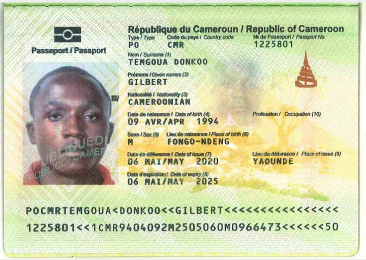

# Passport OCR (Optical Character Recognition)
Extract user data from a passport image.

Extracted info includes:
- Surname
- Name
- Sex
- Date of Birth
- Nationality
- Passport type
- Passport number
- issuing country
- Expiration date
- Personal number

**Note:  Personal numbers aren't used in all country.**


---
### Examples

|**Image** | **Data** |
|--- | ----- |
||```{```<br> ``` 'name': 'GILBERT',```<br>```'surname': 'TEMGOUA DONKOO',```<br>```'sex': 'M',```<br>```'date_of_birth': '09/04/1994',``` <br>```'nationality': 'CAMEROON',```<br>```'passport_type': 'PO',```<br>```'passport_number': '1225801',```<br>```'issuing_country': 'CAMEROON',```<br>```'expiration_date': '06/05/2025',```<br>```'personal_number': 'M0966473'```<br>``` }```|
||```{```<br> ``` 'name': 'MOHAMMED MUDASEER',```<br>```'surname': '',```<br>```'sex': 'M',```<br>```'date_of_birth': '04/04/1982',``` <br>```'nationality': 'INDIA',```<br>```'passport_type': 'P',```<br>```'passport_number': 'H2908283',```<br>```'issuing_country': 'INDIA',```<br>```'expiration_date': '09/02/2019',```<br>```'personal_number': ''```<br>``` }```|
